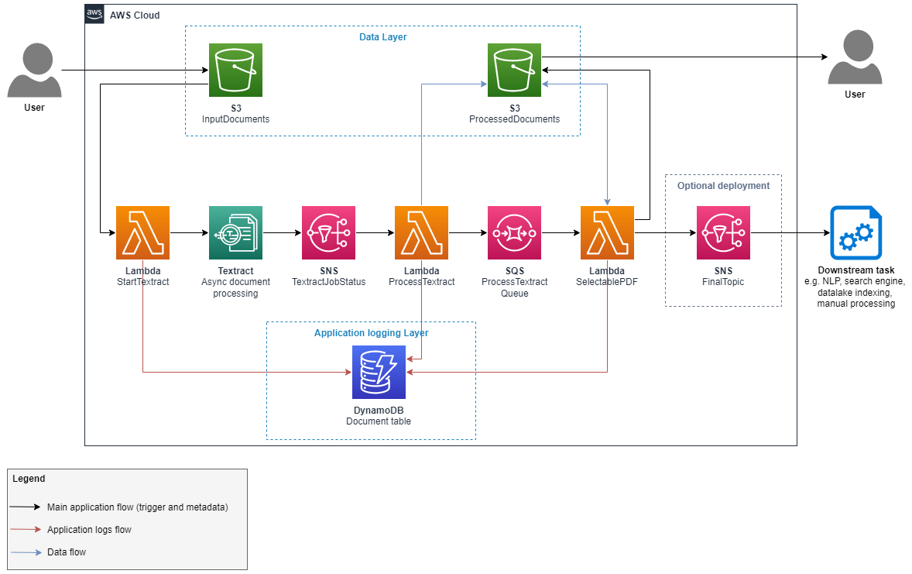

# amazon-textract-large-scale-selectable-pdf

This repository contains an application which converts non-selectable PDF's to 
selectable PDF's. A non-selectable PDF does not allow text selection, meaning the 
characters are in an image, they are pixels. Scanned document are a good example of 
non-selectable PDF. In a selectable PDF, the text is made of real characters, i.e. 
encoded according one of the common standard, such as UTF-8 or ASCI.

There are multitude of applications where a selectable PDF is useful, for example:
* Document search: a PDF is searchable only if the text is encoded with selectable 
  text. For example, [Amazon Kendra](https://aws.amazon.com/kendra/) is an intelligent 
  search service which allows search queries in a large portfolio of documents. For 
  Kendra to perform as expected, the documents need to be searchable.
* Document index: document indexing applications, such as 
  [Amazon CloudSearch](https://aws.amazon.com/cloudsearch/), require the text to 
  be encoded before the indexing process.
* Natural Language Processing (NLP): NLP models require encoded text before they 
  can be trained or used in inference. This application generates the selectable 
  PDF and also the textract response which can be used in downstream NLP tasks.

## Architecture



__Fig.1:__ Architecture diagram of the _large-scale-selectable-pdf_ application.

Figure 1 shows the architecture used by the _large-scale-selectable-pdf_ application. 
The workflow runs as follow:
1. Start by uploading one or several PDF's in the _InputDocument_ Amazon 
   S3 bucket. You can use any folder structure to store the PDFs in the 
   _InputDocument_ bucket: the application is trigger by any uploaded document ending 
   with the `.pdf` extension. An example PDF is available in `examples/SampleInput.pdf`. 
2. Each document uploaded will automatically trigger the _Starttextract_ Amazon
   Lambda function which triggers an asynchronous Textract job. Once the job has 
   completed, the Textract writes a message in the Amazon SNS topic _TextractJobStatus_.
3. Each SNS message triggers the Lambda function _ProcessTextract_ which downloads 
   the Textract response and saves it to S3.  More information about the Textract 
   response can be found in the [Amazon Textract documentation](https://docs.aws.amazon.com/textract/latest/dg/how-it-works-document-layout.html).
4. The Lambda function _SelectablePDF_ is the last and key step of the application. 
   It takes as argument the input PDF and its textract response. The function rasterizes 
   each page of the PDF (i.e. convert the pages to an image) and overlays transparent characters over rasterized characters. These overlaid characters are selectable 
   and don't interfere with the PDF visuals as they are transparent. The pages are 
   rasterized to avoid the "double character" problem if the original PDF already 
   contains selectable text. An example of input and output can be found in the 
   `examples` folder.
5. The final SNS topic can be activate and use to feed to downstream tasks. See section
    __Usage as a module__ for more information.

The Application Logging Layer uses DynamoDB to log the status of each file uploaded 
_InputDocuments_ S3 bucket. These logs are stored in the _Documents_ table.

## Installation

Follow ths instructions in `selectable_pdf_infra/README.md` to deploy the application 
and its infrastructure.

## Usage
1. Upload one or more PDF's in the Amazon S3 bucket _InputDocuments_ (see figure 1). 
   For example, you can upload the file `examples/SampleInput.pdf` included in this 
   repo with:
   ```bash
   aws s3 cp examples/SampleInput.pdf s3://<InputDocuments>
   ```
2. Wait from 1 minute to 30 minutes (depending on the size of the PDF), then you 
   can find the selectable version of the PDF in the _ProcessedDocuments_ S3 bucket. 
   The processed document will have the same name than the input document. You can 
   fetch it via the Amazon UI or with:
   ```bash
   aws s3 cp s3://<ProcessedDocuments>/SampleInput.pdf  examples/SampleInput_selectable.pdf 
   ```

In the _ProcessedDocuments_ bucket, you can also find folders which contains the Textract 
output for each processed document. The folders are named according the document_id generated 
for each processed document. You can link `document_id` and `document_name` with the DynamoDB 
table named `<STACK_NAME>-Documents<UID>`. This table is sorted with the document_id as ID key and 
the document name as hash key. Here is a code snippet to extract `document_id` and 
`document_name` from the DynamoDB table:
```python
import boto3
import json

# after deployment you can find the table name:
# 1. in the CDK outputs
# 2. In the AWS Console: go to the DynamoDB table and look for a table named 
#    `<stack_name>-Documents<UID>` where UID is a set of 15 to 25 random characters 
#    give by CDK to this resource.
table_name = '<stack_name>-Documents<UID>'

ddb_client = boto3.client('dynamodb')
response = ddb_client.scan(TableName=table_name)
for item in response['Items']:
    print(f"doc name: {item['document_name']['S']}, doc ID: {item['document_id']['S']}")
```
You can also get similar results using the DynamoDB helper class in the `helpertools` 
library included in this repository (see `lib/helpertools`). In this example below, 
you need to specify the document ID:
```python
from helpertools import ProcessingDdbTable

# after deployment you can find the table name:
# 1. in the CDK outputs
# 2. In the AWS Console: go to the DynamoDB table and look for a table named 
#    `<stack_name>-Documents<UID>` where UID is a set of 15 to 25 random characters 
#    give by CDK to this resource.
table_name = '<stack_name>-Documents<UID>'
doc_id = 'my_doc_id'
ddb_table = ProcessingDdbTable(table_name)
items = ddb_table.get_items(doc_id)
for item in items: #only one item
   print(f"doc name: {item['document_name']}, doc ID: {item['document_id']}")
```

The Textract output is key for downstream tasks such as Natural Language Processing (NLP).

## Usage as a module
The main goal of this stack is to convert scanned PDF into selectable PDF. Nevertheless, 
this is rarely the end goal. These selectable PDF can be used for downstream tasks 
such as language processing (AI/ML) or indexing for a search engine. You can integrate 
`amazon-textract-large-scale-selectable-pdf` in your stack as follow:
1. install `amazon-textract-large-scale-selectable-pdf` in your python environnement 
   with 
   ```bash
   $ pip install "git+https://github.com/aws-samples/amazon-textract-large-scale-selectable-pdf.git#egg=selectable_pdf_infra&subdirectory=selectable_pdf_infra"
   ```
2. in your CDK app (e.g. `app.py`), deploy the `amazon-textract-large-scale-selectable-pdf` 
   stack and reuse its resources with:
   ```python
   import aws_cdk as cdk
   from selectable_pdf_infra.selectable_pdf_stack import SelectablePdfStack
   from my_downstream_stack import DownstreamStack

   app = cdk.App()
   ocr_stack = SelectablePdfStack(app, 'ocr-stack', add_final_sns=True)
   ds_stack = DownstreamStack(app, 'ds-stack',
      bucket_with_original_pdfs=ocr_stack.doc_bucket,
      bucket_with_process_pdfs=ocr_stack.processed_bucket,
      sns_trigger=ocr_stack.final_sns_topic
   )
   ```
   the variable `ocr_stack.final_sns_topic` represents an Amazon SNS topic.
   The topic is created by `ocr_stack` only if `add_final_sns=True`. The `ocr_stack` 
   will publish a message in this topic with information about each processed 
   document. Example of message:
   ```json
   {
      "document_name": "SampleInput.pdf",
      "document_id": "<doc-id>",
      "textract_response_s3": {
         "bucket": "",
         "key": "<doc-id>/"
      }
      "processed_document_s3": {
         "bucket": "<processed_doc_bucket>",
         "key": "SampleInput.pdf"
      },
      
      "original_document_s3": {
         "bucket": "<input_doc_bucket>",
         "key": "SampleInput.pdf"
      }
   }
   ```
   You can use this sns message by subscribing the SNS topic to one of the resources 
   in `ds_stack`.

## Notes
* Partially based on this (AWS blog post)[https://aws.amazon.com/blogs/machine-learning/generating-searchable-pdfs-from-scanned-documents-automatically-with-amazon-textract/].

## Security

See [CONTRIBUTING](CONTRIBUTING.md#security-issue-notifications) for more information.

## License

This library is licensed under the MIT-0 License. See the LICENSE file.